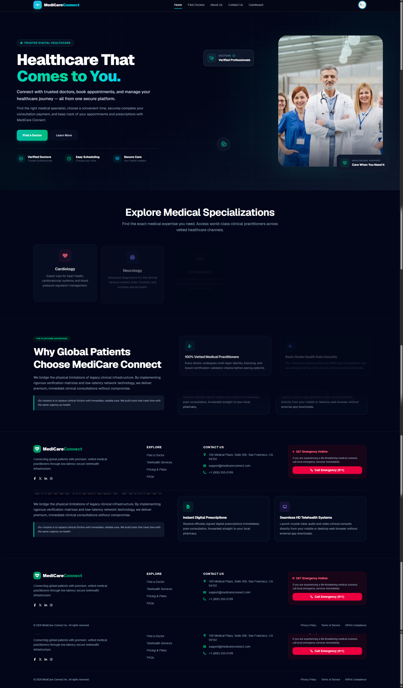
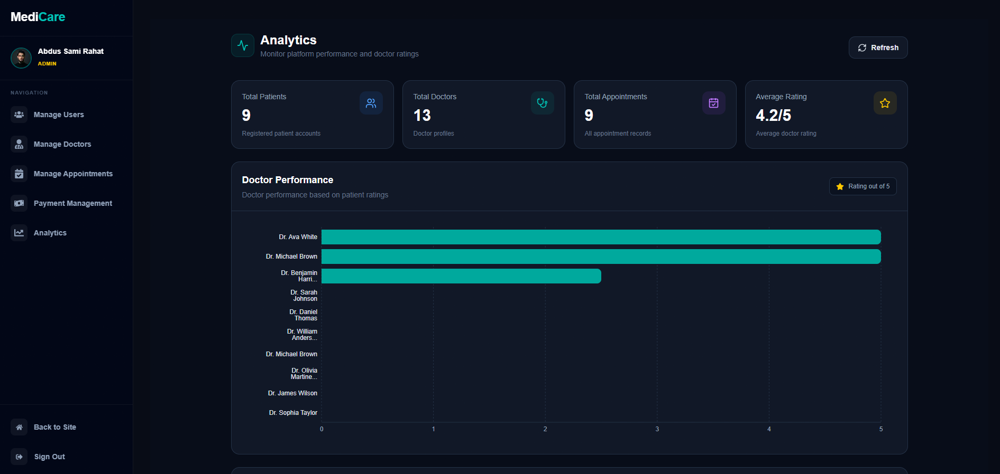

# 🏥 Medi-Care

```{=html}
<p align="center">
```
`<strong>`{=html}A modern full-stack healthcare platform for discovering
doctors, booking appointments, managing payments, and administering
healthcare services.`</strong>`{=html}
```{=html}
</p>
```
```{=html}
<p align="center">
```
Built with `<strong>`{=html}Next.js`</strong>`{=html} •
`<strong>`{=html}Express.js`</strong>`{=html} •
`<strong>`{=html}MongoDB`</strong>`{=html} •
`<strong>`{=html}BetterAuth`</strong>`{=html} •
`<strong>`{=html}Stripe`</strong>`{=html}
```{=html}
</p>
```

------------------------------------------------------------------------

## 📸 Project Preview

### Patient-facing Website



### Admin Dashboard & Analytics



------------------------------------------------------------------------

## ✨ About the Project

**Medi-Care** is a full-stack healthcare management platform designed to
connect patients with verified healthcare professionals through a clean,
responsive, and secure digital experience.

The platform supports different user roles and provides dedicated
workflows for:

-   👤 Patients
-   🩺 Doctors
-   🛡️ Administrators

Patients can discover doctors, filter specialists, view doctor profiles,
book appointments, make payments, and manage their appointments.

Doctors can manage their professional profiles and participate in the
appointment workflow, while administrators can manage users, verify
doctors, monitor appointments and payments, and view platform analytics.

------------------------------------------------------------------------

## 🚀 Key Features

### 👤 Patient Features

-   🔐 Email/password authentication
-   🔵 Google authentication
-   👤 Patient profile management
-   🔎 Search doctors by name and relevant information
-   🩺 Filter doctors by specialization
-   📊 Filter doctors by experience
-   💰 Filter doctors by consultation fee
-   ✅ Browse verified doctors
-   📄 Paginated doctor listing
-   👨‍⚕️ View detailed doctor profiles
-   📅 Book doctor appointments
-   🔄 Reschedule appointments
-   ❌ Cancel appointments
-   📋 View appointment history
-   💳 Secure Stripe payment flow
-   💰 View payment records
-   🔔 Authentication and action feedback
-   📱 Responsive experience across screen sizes

------------------------------------------------------------------------

### 🩺 Doctor Features

-   🔐 Secure authentication
-   👤 Doctor profile management
-   🏥 Professional information management
-   🩺 Specialization and qualifications
-   💼 Experience information
-   💵 Consultation fee management
-   🏥 Hospital information
-   📅 Available days
-   ⏰ Available appointment slots
-   🖼️ Profile image support
-   ⏳ Doctor verification workflow
-   📊 Doctor-related dashboard access
-   🔒 Role-based access control

------------------------------------------------------------------------

### 🛡️ Admin Features

-   📊 Admin dashboard
-   👥 Manage users
-   🩺 Manage doctors
-   ✅ Verify doctor registrations
-   ❌ Reject doctor verification
-   🔄 Manage doctor verification status
-   📅 Manage appointments
-   💳 Payment management
-   📈 Platform analytics
-   👤 Monitor registered patients
-   🩺 Monitor registered doctors
-   📅 Monitor appointment records
-   ⭐ Analyze doctor ratings
-   📊 Doctor performance visualization
-   🚫 User blocking/suspension support
-   🔐 Role-based admin authorization

------------------------------------------------------------------------

## 📊 Analytics Dashboard

The admin analytics section provides an overview of important platform
metrics.

### Dashboard Metrics

-   Total Patients
-   Total Doctors
-   Total Appointments
-   Average Doctor Rating

### Doctor Performance

The dashboard includes a visual performance chart based on doctor
ratings, making it easier for administrators to monitor doctor
performance across the platform.

------------------------------------------------------------------------

## 🔐 Authentication & Authorization

Medi-Care uses **BetterAuth** for authentication and role-based access
control.

### Supported Authentication

-   Email & Password
-   Google OAuth
-   Secure sessions
-   Role-based authorization
-   Protected dashboard routes

### User Roles

  Role        Main Access
  ----------- ----------------------------------------------------
  `patient`   Doctors, appointments, payments, patient dashboard
  `doctor`    Doctor profile and doctor dashboard
  `admin`     Users, doctors, appointments, payments, analytics

The application also uses protected backend endpoints and role-based
permissions to prevent unauthorized access.

------------------------------------------------------------------------

## 👨‍⚕️ Doctor Discovery

The doctor directory is designed to make finding healthcare
professionals simple.

Users can:

-   Search doctors
-   Filter by specialization
-   Filter by experience
-   Filter by consultation fee
-   View only verified doctors
-   Navigate through multiple pages
-   Open individual doctor profiles

### Pagination

Doctor listings use server-side pagination with configurable page size,
helping the platform handle larger numbers of doctor records
efficiently.

------------------------------------------------------------------------

## 📅 Appointment Management

Patients can manage their appointments from their dashboard.

### Appointment Workflow

``` text
Find Doctor
    ↓
View Doctor Profile
    ↓
Select Available Date & Slot
    ↓
Book Appointment
    ↓
Complete Payment
    ↓
Appointment Confirmation
    ↓
Manage / Reschedule / Cancel
```

Supported appointment states include workflows for:

-   Pending
-   Confirmed
-   Rescheduled
-   Completed
-   Cancelled

------------------------------------------------------------------------

## 💳 Payment System

Medi-Care integrates **Stripe Checkout** for appointment payments.

### Payment Flow

``` text
Appointment
    ↓
Stripe Checkout
    ↓
Payment Confirmation
    ↓
Payment Record
    ↓
Appointment Payment Status
```

The system tracks payment-related information and connects successful
payments with appointment records.

------------------------------------------------------------------------

## 🛡️ Doctor Verification

Doctor registration includes a verification workflow so administrators
can control which professional profiles become publicly available.

### Verification Flow

``` text
Doctor Registration
        ↓
Verification Pending
        ↓
Admin Review
     ↙     ↘
 Verify    Reject
   ↓
Public Doctor Listing
```

Only doctors with the appropriate verified status are shown in the
public doctor directory.

------------------------------------------------------------------------

## 🧑‍💻 Tech Stack

### Frontend

  Technology            Purpose
  --------------------- -----------------------------------------
  **Next.js**           React framework and application routing
  **React.js**          UI development
  **JavaScript**        Application logic
  **Tailwind CSS**      Styling and responsive design
  **HeroUI**            UI components
  **Recharts**          Analytics and data visualization
  **React Hook Form**   Form management
  **React Toastify**    User notifications

### Backend

  Technology       Purpose
  ---------------- ----------------------------------
  **Node.js**      Backend runtime
  **Express.js**   REST API
  **MongoDB**      Database
  **BetterAuth**   Authentication and authorization
  **Stripe**       Online payments

### Development & Deployment

-   Git
-   GitHub
-   VS Code
-   Postman
-   Vercel
-   MongoDB
-   REST API architecture

------------------------------------------------------------------------

## 🏗️ System Architecture

Medi-Care follows a separated frontend/backend architecture:

``` text
                    ┌─────────────────────┐
                    │      User           │
                    │ Patient / Doctor    │
                    │       / Admin       │
                    └──────────┬──────────┘
                               │
                               ▼
                    ┌─────────────────────┐
                    │     Next.js         │
                    │      Frontend       │
                    └──────────┬──────────┘
                               │
                         REST API
                               │
                               ▼
                    ┌─────────────────────┐
                    │     Express.js      │
                    │       Backend       │
                    └──────┬───────┬──────┘
                           │       │
              ┌────────────┘       └────────────┐
              ▼                                 ▼
     ┌─────────────────┐              ┌─────────────────┐
     │    MongoDB      │              │     Stripe      │
     │    Database     │              │    Payments     │
     └─────────────────┘              └─────────────────┘
```

------------------------------------------------------------------------

## 📁 Main Project Modules

``` text
Medi-Care
│
├── Authentication
│   ├── Email & Password
│   ├── Google OAuth
│   ├── Sessions
│   └── Role-based Access
│
├── Doctors
│   ├── Doctor Listing
│   ├── Search
│   ├── Filters
│   ├── Pagination
│   ├── Doctor Details
│   └── Verification
│
├── Appointments
│   ├── Booking
│   ├── Rescheduling
│   ├── Cancellation
│   └── Status Management
│
├── Payments
│   ├── Stripe Checkout
│   ├── Payment Records
│   └── Payment Status
│
├── Patient Dashboard
│   ├── Profile
│   ├── Appointments
│   └── Payments
│
├── Doctor Dashboard
│   └── Doctor Management
│
└── Admin Dashboard
    ├── Users
    ├── Doctors
    ├── Appointments
    ├── Payments
    └── Analytics
```

------------------------------------------------------------------------

## 🎨 UI & UX

The interface focuses on a modern healthcare aesthetic with:

-   🌙 Dark professional interface
-   💠 Cyan/teal accent colors
-   📱 Responsive layouts
-   🧩 Reusable UI components
-   🎯 Clear navigation
-   🪄 Smooth interactions
-   📊 Data-focused dashboard design
-   ♿ Accessible visual hierarchy
-   🖥️ Desktop and mobile friendly layouts

------------------------------------------------------------------------

## 🔒 Security Considerations

The application includes several security-focused practices:

-   Protected authentication routes
-   Role-based authorization
-   Backend API validation
-   Secure authentication sessions
-   Protected admin functionality
-   Doctor verification before public listing
-   Environment variables for sensitive configuration
-   Stripe-based payment processing

> **Note:** Never commit `.env` files, API keys, database credentials,
> OAuth secrets, or Stripe secret keys to GitHub.

------------------------------------------------------------------------

## ⚙️ Environment Variables

Create a `.env.local` file for the frontend and an `.env` file for the
backend.

### Frontend

``` env
BETTER_AUTH_SECRET=your_secret
BETTER_AUTH_URL=http://localhost:3000

MONGODB_URI=your_mongodb_uri
DB_NAME=mediCareDB

NEXT_PUBLIC_IMGBB_API_KEY=your_imgbb_key
NEXT_PUBLIC_BASE_URL=http://localhost:3000
NEXT_PUBLIC_SERVER_URL=http://localhost:5000

NEXT_PUBLIC_STRIPE_PUBLISHABLE_KEY=your_stripe_publishable_key
STRIPE_SECRET_KEY=your_stripe_secret_key

GOOGLE_CLIENT_ID=your_google_client_id
GOOGLE_CLIENT_SECRET=your_google_client_secret
```

### Backend

``` env
MONGODB_URI=your_mongodb_uri
CLIENT_URI=http://localhost:3000
```

For production, replace localhost URLs with your deployed frontend and
backend URLs.

------------------------------------------------------------------------

## 🛠️ Installation & Setup

### 1. Clone the repository

``` bash
git clone YOUR_REPOSITORY_URL
cd medi-care
```

### 2. Install dependencies

``` bash
npm install
```

### 3. Configure environment variables

Create the required `.env.local` / `.env` files and add your
credentials.

### 4. Start the development server

``` bash
npm run dev
```

The frontend will normally run at:

``` text
http://localhost:3000
```

Start the Express backend separately:

``` bash
npm run dev
```

The backend will normally run at:

``` text
http://localhost:5000
```

------------------------------------------------------------------------

## 🔌 API Integration

The frontend communicates with the Express backend through REST APIs.

Major API areas include:

``` text
/api/doctors
/api/appointments
/api/payment
/api/admin/users
/api/admin/doctors
```

The architecture keeps frontend presentation and backend business logic
separated, making the application easier to maintain and extend.

------------------------------------------------------------------------

## 📈 Future Improvements

Possible future improvements include:

-   💬 Doctor-patient messaging
-   🔔 Real-time appointment notifications
-   📧 Email appointment reminders
-   📱 Progressive Web App support
-   🧾 Downloadable payment invoices
-   🗓️ Advanced calendar integration
-   ⭐ Patient review and rating management
-   📊 More advanced admin reports
-   🌐 Multi-language support

------------------------------------------------------------------------

## 🎯 Project Goals

Medi-Care was built to demonstrate practical full-stack development
skills including:

-   Modern React/Next.js development
-   REST API integration
-   Authentication and authorization
-   Role-based application architecture
-   MongoDB database management
-   Payment gateway integration
-   Dashboard development
-   Data visualization
-   Responsive UI design
-   Production deployment

------------------------------------------------------------------------

## 👨‍💻 Developer

**Abdus Sami Rahat**

Frontend / Full-Stack Web Developer

-   GitHub: [@asrahat](https://github.com/asrahat)
-   LinkedIn: [Abdus Sami
    Rahat](https://www.linkedin.com/in/abdus-sami-rahat/)
-   Portfolio:
    [myself-theta-five.vercel.app](https://myself-theta-five.vercel.app)

------------------------------------------------------------------------

## ⭐ Support

If you find this project useful or interesting, consider giving the
repository a ⭐ on GitHub.

------------------------------------------------------------------------

```{=html}
<p align="center">
```
`<strong>`{=html}Built with ❤️ by Abdus Sami Rahat`</strong>`{=html}
```{=html}
</p>
```
